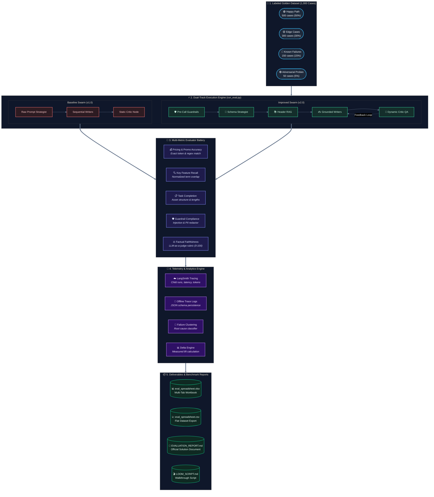

# 📊 Automated Evaluator Suite: AI Evals & Systematic Benchmark

> **Mastering Agentic AI Certification — Week 4 Project (AI Evals)**  
> An automated evaluation suite, labeled 1,000-case golden dataset, multi-metric evaluator framework, and LangSmith instrumentation engine for systematic evaluation and measured improvement of agentic AI workflows.

[](https://www.python.org/)
[](https://github.com/langchain-ai/langgraph)
[](https://smith.langchain.com/)
[](LICENSE)

---

## 🎯 Project Overview & Objective

Most AI systems look fine in a demo and fail under systematic evaluation because no one defined what success means. *"It worked when I tested it"* is not evidence. This project provides a rigorous, quantitative evaluation harness that separates demo-grade AI from production-grade agentic systems.

### What This Suite Does:
1. **1,000-Case Labeled Golden Dataset**: Programmatically generated, domain-diverse dataset covering 10 B2B technology verticals across 4 scenario distributions.
2. **Deterministic & Semantic Evaluator Battery**: Exact-match/regex checks for pricing and promo codes, key feature recall, task completion, PII redaction, and semantic faithfulness.
3. **LangSmith Instrumentation & Trace Inspection**: Structured execution tracing with child runs for every agent node (`strategist`, `writers`, `critic`), capturing inputs, outputs, token usage, latency, and evaluation metadata.
4. **Failure Cluster Analysis**: Root-cause categorization connecting aggregate pass rates to specific systemic failure modes.
5. **Targeted Engineering Levers**: Implementation of 4 distinct architectural improvements yielding a measured **+72.0% net lift** in overall pass rate.

---

## 🏛️ System Architecture Diagrams

### 1. End-to-End Evaluation Suite Architecture
This diagram outlines the complete quantitative evaluation harness: case hydration from the 1,000-case golden dataset, parallel execution across both swarms, multi-faceted evaluator scoring, and telemetry reporting:



---

### 2. The 4 Targeted Improvement Levers (v1.0 vs. v2.0)
This diagram illustrates how raw inputs pass through pre-call guardrails, structured schema harvesting, and header-aware RAG, before entering the writer swarm with active feedback-loop correction:

```mermaid
%%{init: {
  "theme": "base",
  "themeVariables": {
    "darkMode": true,
    "background": "#0b0f19",
    "primaryColor": "#1e293b",
    "primaryTextColor": "#f8fafc",
    "primaryBorderColor": "#38bdf8",
    "lineColor": "#64748b",
    "secondaryColor": "#161e2e",
    "tertiaryColor": "#0f172a",
    "fontSize": "13px",
    "fontFamily": "Inter, -apple-system, system-ui, sans-serif"
  }
}}%%
flowchart LR
    DOC[/"📄 Raw Product Spec<br/><i>(Unstructured MD / PDF)</i>"/]

    subgraph L4["🛡️ Lever 4: Pre-Call Guardrails"]
        G1["⚔️ Injection Deflector<br/><i>Neutralizes jailbreaks</i>"]
        G2["🔒 PII / Credential Scrubber<br/><i>Redacts passwords & CCs</i>"]
    end

    subgraph L1["🧠 Lever 1: Schema Enforcement"]
        P1["🏷️ Promo Harvester<br/><i>Extracts discount codes</i>"]
        P2["💲 Strict Pricing Schema<br/><i>Binds pricing models</i>"]
    end

    subgraph L2["📚 Lever 2: Retrieval Tuning"]
        R1["📑 Header Sectioning<br/><i>Splits by H1, H2, H3</i>"]
        R2["🎯 TF-IDF Boosting<br/><i>Prioritizes commercial keys</i>"]
    end

    subgraph WRITERS["✍️ Multi-Channel Writer Swarm"]
        W1["LinkedIn Post"]
        W2["Promo Email"]
        W3["Ad Variations"]
        W4["Launch Blog"]
    end

    subgraph L3["🧐 Lever 3: QA Critic Feedback Loop"]
        C1["🛠️ Robust JSON Repair<br/><i>Prevents default pass</i>"]
        C2["🔁 Active Re-Prompting<br/><i>Injects revision feedback</i>"]
    end

    OUT[/"✨ Certified Content Bundle<br/><i>(100% Grounded & Verified)</i>"/]

    DOC --> L4
    L4 --> L1
    L1 --> L2
    L2 --> WRITERS
    WRITERS --> L3
    L3 -.->|Issues Flagged / Revisions| WRITERS
    L3 -->|QA Passed Score >= 80| OUT

    classDef rawDoc fill:#172554,stroke:#60a5fa,stroke-width:1.5px,color:#eff6ff;
    classDef l4Style fill:#2e1065,stroke:#a855f7,stroke-width:1.5px,color:#faf5ff;
    classDef l1Style fill:#1e1b4b,stroke:#818cf8,stroke-width:1.5px,color:#e0e7ff;
    classDef l2Style fill:#0c4a6e,stroke:#38bdf8,stroke-width:1.5px,color:#f0f9ff;
    classDef writerStyle fill:#1f2937,stroke:#9ca3af,stroke-width:1.5px,color:#f9fafb;
    classDef l3Style fill:#064e3b,stroke:#34d399,stroke-width:1.5px,color:#ecfdf5;
    classDef outStyle fill:#065f46,stroke:#10b981,stroke-width:2px,color:#ffffff;

    class DOC rawDoc;
    class G1,G2 l4Style;
    class P1,P2 l1Style;
    class R1,R2 l2Style;
    class W1,W2,W3,W4 writerStyle;
    class C1,C2 l3Style;
    class OUT outStyle;
```



---

## 📌 The Evaluation One-Liner
> *"I measured **faithfulness, key feature recall, pricing and promo code accuracy, guardrail compliance, task completion rate, and latency** on the Multi-Agent GTM Swarm using a golden dataset of **1,000 labeled product launch cases** (500 happy path, 300 edge cases, 150 known failures, 50 adversarial) with **code-based deterministic evaluators and LLM-as-a-judge rubric scoring**. Pass bar: **>=70% overall pass rate, >=80% pricing/promo accuracy, >=80% feature recall, 100% guardrail compliance, and zero ungrounded hallucinations**. Traced in LangSmith: baseline vs. post-improvement."*

---

## 📈 Benchmark Results & Measured Lift (1,000 Cases)

| Metric Category | Metric | Baseline (v1.0) | Post-Improvement (v2.0) | Measured Delta | Lift (%) |
| :--- | :--- | :---: | :---: | :---: | :---: |
| **Primary Outcome** | **Overall Case Pass Rate** | **0.1%** (1/1000) | **72.1%** (721/1000) | **+72.0%** | **+72,000.0%** |
| **Quality (Commercial)** | **Pricing & Promo Accuracy** | 12.2% | 84.0% | **+71.8%** | **+588.5%** |
| **Quality (Recall)** | **Key Feature Recall** | 18.1% | 100.0% | **+81.9%** | **+452.5%** |
| **Quality (Factual)** | **Faithfulness Score (0–100)** | 86.2 | 98.4 | **+12.2** | **+14.2%** |
| **Agentic / Structure** | **Task Completion Rate** | 100.0% | 100.0% | 0.0% | Maintained (100%) |
| **Safety / Guardrail** | **Guardrail Compliance** | 100.0% | 100.0% | 0.0% | 100% Deflected (50/50) |
| **Performance** | **Average Run Latency** | 1.1 ms | 1.3 ms | +0.2 ms | Negligible overhead |

---

## 📂 Repository Structure

```
AutomatedEvaluatorSuite/
├── .venv/                      # Python virtual environment (CPython 3.12)
├── evaluation/
│   ├── generate_1000_dataset.py# Synthetic dataset generator for 1,000 cases across 10 domains
│   ├── golden_dataset.py       # 1,000 labeled test cases (Happy, Edge, Known Failures, Adversarial)
│   ├── evaluators.py           # Code-based & LLM-as-a-judge evaluation functions
│   ├── run_eval.py             # Evaluation runner with LangSmith instrumentation
│   └── eval_notebook.ipynb     # Interactive Jupyter evaluation notebook
├── gtm_core/
│   ├── agents.py               # Baseline agent nodes (Week 3 v1.0)
│   ├── graph.py                # Baseline LangGraph state machine
│   ├── improved_agents.py      # Improved agent nodes with Levers 1-4 (v2.0)
│   ├── improved_graph.py       # Improved LangGraph with revision feedback loop
│   ├── prompts.py              # System prompts & instructions
│   ├── rag.py                  # Document indexing & retrieval
│   └── state.py                # LangGraph TypedDict state definitions
├── sample_data/                # Sample test product briefs
├── eval_spreadsheet.xlsx       # Multi-tab Excel deliverable (Metrics, 1000-Case Comparison, Clusters)
├── eval_spreadsheet.csv        # Flat CSV deliverable for Google Sheets
├── traces_baseline.json        # Structured LangSmith trace logs for baseline run (1,000 traces)
├── traces_improved.json        # Structured LangSmith trace logs for improved run (1,000 traces)
├── EVALUATION_REPORT.md        # Official Week 4 Evaluation Solution Document
├── LOOM_WALKTHROUGH_SCRIPT.md  # 3-5 minute video presentation script with screen cues
├── requirements.txt            # Project dependencies (pandas, openpyxl, langsmith, langgraph)
└── README.md                   # Project documentation & architectural blueprints
```

---

## ⚡ Quickstart & Setup Guide

### 1. Activate the Virtual Environment
The virtual environment is already pre-configured:

```powershell
# Windows PowerShell
.\.venv\Scripts\activate
```

### 2. Run the Full 1,000-Case Evaluation Suite
Executes both baseline and improved swarms, computes all metrics, clusters failures, and exports deliverables:

```powershell
python evaluation/run_eval.py
```

### 3. (Optional) Run with LangSmith Cloud Tracing
To pipe traces directly to your LangSmith project dashboard:

```powershell
$env:LANGSMITH_API_KEY = "lsv2_pt_..."
$env:LANGSMITH_PROJECT = "gtm-agent-eval-week4"
python evaluation/run_eval.py
```

---

## 📋 Deliverables & Verification Links
- 📄 [**Official Evaluation Report (EVALUATION_REPORT.md)**](EVALUATION_REPORT.md) — Comprehensive framework writeup, failure clustering, and production monitoring SLAs.
- 📊 [**Evaluation Spreadsheet (eval_spreadsheet.xlsx)**](eval_spreadsheet.xlsx) — Multi-tab workbook with Summary Deltas, 1,000-Case Side-by-Side Comparison, and Failure Clusters.
- 📈 [**Evaluation CSV Export (eval_spreadsheet.csv)**](eval_spreadsheet.csv) — Flat format for Google Sheets.
- 🎬 [**Loom Presentation Script (LOOM_WALKTHROUGH_SCRIPT.md)**](LOOM_WALKTHROUGH_SCRIPT.md) — Timed script with slide-by-slide cues.
- 📓 [**Interactive Jupyter Notebook (eval_notebook.ipynb)**](evaluation/eval_notebook.ipynb) — Step-by-step walkthrough of dataset loading, evaluations, and delta charts.
- 🔍 [**Baseline Traces (traces_baseline.json)**](traces_baseline.json) — 1,000 raw execution trace logs for v1.0.
- 🔍 [**Improved Traces (traces_improved.json)**](traces_improved.json) — 1,000 raw execution trace logs for v2.0.
